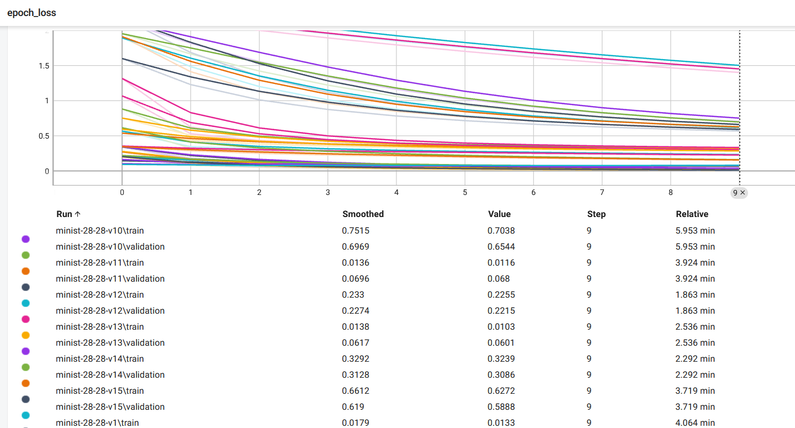
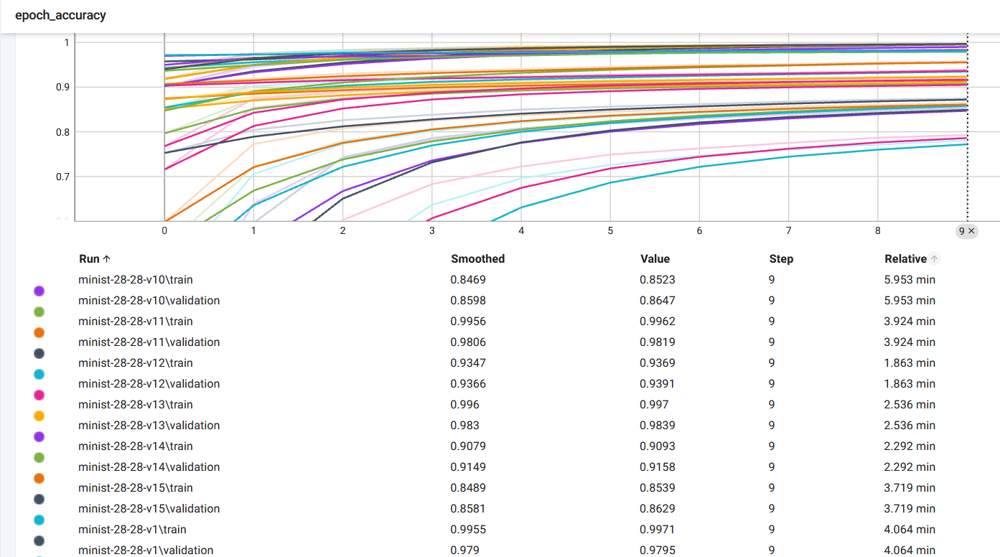

# 🧠 Neural Network Training Visualization with TensorBoard

This project demonstrates how to build and monitor a deep learning model using TensorFlow and TensorBoard.

---

## 🎯 Project Objective

Train a neural network on tabular data and use TensorBoard to visualize the model's training performance over time. This includes tracking accuracy, loss, and detecting overfitting using validation curves.

---

## 🛠️ Tools & Technologies

- Python
- TensorFlow / Keras
- TensorBoard
- NumPy, Pandas
- Matplotlib

---

## 🚀 Workflow

1. Preprocess dataset (cleaning, normalization)
2. Build a neural network using Keras
3. Use callbacks to monitor training via TensorBoard
4. Visualize metrics: training loss, validation loss, accuracy
5. Apply techniques like Dropout and EarlyStopping

---

## 📁 Project Structure

```
nn_tensorboard_visualization/
├── images/
│   ├── rf_feature_importance.png
│   └── nn_loss_curve.png
├── tensorboard.ipynb
├── README.md
└── requirerequirements.txt
```

---

## 📉 Training vs Validation Loss



## 📈 Training vs Validation Accuracy



---

## 👨‍💻 Author

**Adham Khalifa**  
📫 [LinkedIn](https://www.linkedin.com/in/abn-khalifa)
💻 [GitHub](https://github.com/AbnKhalifa)

---

## 📄 License

This project is open source and available under the [MIT License](LICENSE).
